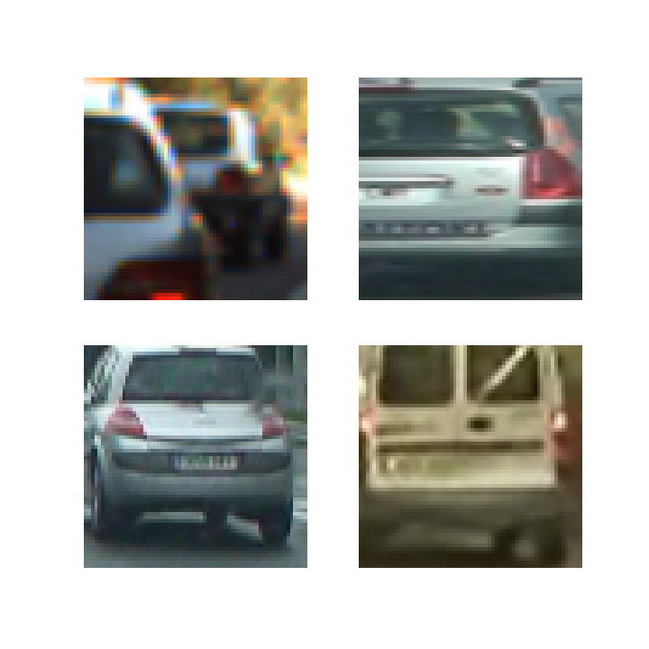
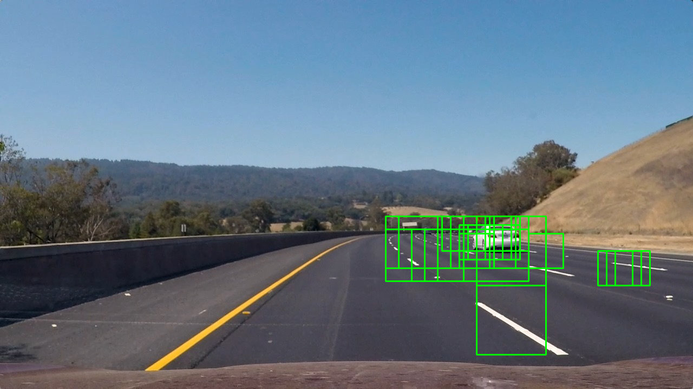

## Vehicle Detection

---
## Overview
The goal of this project is to identify cars in a video stream and draw a bounding box around them.  One difficulty with such a detection problem is that we do not know in advance how many cars there might be.  This makes it difficult to use a traditional learning algorithm, such as regression, as the number of outputs (bounding boxes for the car locations) is variable.

A nice solution is to treat detection as region proposal + classification.  This breaks the problem into two parts: we train a classifier to recognize if an image contains a car or not.  We then identify (many) windows of the image where a car might be located, and then use the classifier on the image cropped to this window.  

This approach breaks our pipeline down into roughly three steps. 

###1) Train a classifier to identify car versus non-car.
For this step we will use data from the GTI vehicle image database and the KITTI vision benchmark suite to train a classifier to identify cars.  We will experiment with many different feature sets and classifiers to determine what works best

###2) Identify regions where a car might be located. 
We use the most naive algorithm for this step.  We simply check all possible locations by sliding a window accross the image. 

###3) Integrate the positive identifications
After we run the classifier on each sliding window, we then need to aggregate this information to throw out likely false positives and generate bounding boxes around the cars.

*Note about code:* Some of our exploratory data analysis and pipeline experimentation can be found in the jupyter notebook `data_exploration.ipynb` (an html version is also included).  After playing around in the jupyter notebook, we finalized the code in python scripts.  The code related to training the classifier can be found in the files `make_dataset.py`, `make_testset.py`, `classifier.py`.  The code for detecting cars from a video stream is in the file `pipeline.py`.

----
## Classifier
We first discuss how we designed a classifier to determine if an image contains a car or not. We first did some exploratory analysis of the data to narrow down the choice of good features.  

Here are 4 random car examples from the dataset.



And 4 random non-car examples.


Udacity suggested using 3 types of features: histogram of oriented gradients, histogram of colors, and actual pixel values of a downsampled image.  We will look at these different features on these examples to see what distinguishes cars from non-cars.

###Histogram of Oriented Gradients (HOG)

*Grayscale*: We first looked at taking the histogram of gradients on a grayscale image.  We did this as follows:

```
gray = cv2.imread(file,0)
features, hog_image = hog(gray, orientations=8, pixels_per_cell=(8, 8),                
    cells_per_block=(2, 2), visualise=True, feature_vector=False)
```

For our example car images, the result looked as follows.


And for the non-car examples:


Visually, it seems that the car examples possess a greater range of gradient angles.  This is because the outline of a car is roughly semi-circular.  In the non-car examples, there are some strong gradients but they seem to be of a more consistent angle.  This makes sense as the non-car examples contain things like lane lines and barriers.

*HLS*: We also looked at histogram of gradients on the lightness and saturation channel of the HLS colorspace.  For the lightness channel, the car examples look like this.


And for the non-car examples.


Here are the car examples on the saturation channel.


And for the non-car examples.


Both the L and the S channels look like they would do well to distinguish cars from non-cars.

###Downsampled image
Another feature we will use is the actual pixel values of a downsampled image.  Including this feature improved the accuracy of our linear SVM classifier.  We found that a 32-by-32 size image worked the best.

###Color Histogram
Cars also have a greater variety of colors than the surrounding road features.  To take advantage of this in our classifier, we also included color features in the form of a histogram of the R,G,B pixel intensities.  In code, this looks as follows for an image in the BGR colorspace:

```
Bhist = np.histogram(img[:,:,0],bins = 32, range = (0,256))
Ghist = np.histogram(img[:,:,0],bins = 32, range = (0,256))
Rhist = np.histogram(img[:,:,0],bins = 32, range = (0,256))
```

Here is an example of the difference in the blue histogram between our example car and non-car images.  The cars:


And the non-cars:


This feature also looks like it would do well to distinguish cars from noncars.  The car images have a more spread out distribution of pixel intensities.

The code that we used to make datasets with different types of features is in the file `make_dataset.py`.

## Classifier Experiments
The code we used for the classifier is `classifier.py`.

At the end, the real test of a set of features is how well a classifier can do using them.  Using the GTI vehicle image database and the KITTI vision benchmark suite, we trained a Linear SVM and SVM with radial basis function kernel with different feature sets to see which features worked best.  For these experiments we used a random 80%/20% split of the data into training and test sets (the same split was used in all trials).

| classifier | features | accuracy |
|------------|----------|----------|
| linear svm | grayscale hog | 95% |
| rbf svm | grayscale hog | 97.3% |
|linear svm | grayscale hog + 8-by-8 downsampled RGB pixel values | 97.2% |
|rbf svm | grayscale hog + 8-by-8 downsampled RGB pixel values | 97.7% |
|linear svm | grayscale hog + 16-by-16 downsampled RGB pixel values | 97.3% |
|rbf svm | grayscale hog + 16-by-16 downsampled RGB pixel values | 97.8% |
|linear svm | grayscale hog + 32-by-32 downsampled RGB pixel values | 97.6% |
|2-layer MLP | grayscale hog + 32-by-32 downsampled RGB pixel values | 99% |
|linear svm | RGB hog features | 96.9% |
|2-layer MLP| RGB hog features | 98.7% |
|linear svm | 10 bins L+S hog features + 32-by-32 downsampled RGB pixel values | 98.1% |

For these experiments we found the svm performed best with C = 0.01.  For the 2-layer neural networks, we used a hidden layer with 128 nodes.  

Although the radial basis function kernel in general performed better than the linear svm, it was also much slower so we stayed with the linear svm as our classifier.  It is also interesting that using a 2-layer neural network also saw quite a boost in performance. This makes sense as a linear svm is essentially a 1-layer neural network with a hinge loss function.  To stay within the project guidelines at then end we chose to go with a linear svm as our classifier.

From these tests we also learned that the hog features did better with 10 orientation bins than 8, and seemed to work best with 8-by-8 pixels per cell and 2-by-2 cells for block normalization --- for the latter we tried a few different combinations, but did not do extensive testing.

## Homegrown Test Set
The code to create the homegrown test set is in `make_testset.py`.

These preliminary classifier experiments helped to narrow down our feature selection.  I was slightly worried, however, that there was correlation between the training and test sets.  A lot of the dataset images were grabbed from video, thus there were many similar images.  By doing a random train/test split, we could have images in the test set that were very similar to images in the training set.

At the end, we really want our classifier to perform well on images from the project video.  Thus to create an independent test, and to see how the classifier would perform in the environment it would be deployed in, I made a new test set from images from the project video.  At the end I used 6 images (the test images provided by Udacity), grabbing 64-by-64 pixel windows of these images with the sliding window setup of my pipeline.  This provided about 1000 images for the test set.  The hardest part of this step was identifying which images should be labeled car or not.


Should this be classified as a car?

Here are our results on this homegrown test set.

| classifier | features | accuracy |
|------------|----------|----------|
|linear svm | L+S hog + 32-by-32 downsampled RGB pixels | 92.3% |
|linear svm | L+S hog + 32-by-32 downsampled RGB pixels + 32 HLS color bins| 92.7|
|linear svm | 64-by-64 RGB pixel values | 89.8% |
|linear svm | grayscale hog + 32-by-32 downsampled RGB pixels + 32 RGB color bins | 92.7 |
|linear svm | L+S hog + 32-by-32 downsampled RGB pixels + 32 RGB color bins | 93.1 |

As we can see, the performance is quite a bit worse on the homegrown test set, the types of images where we will actually apply the classifier.  

The best feature set that we tried here was the doing HOG on the Lightness and Saturation channels of the HLS colorspace, giving the 32-by-32 RGB pixel values, and including a histogram with 32 bins of the RGB pixel instensities.  We trained this with a linear svm with C = 0.01.  

Here are the helper functions we used to create our features.

```
def make_hog(channel):
    features = hog(channel, orientations=10, pixels_per_cell=(8, 8),
        cells_per_block=(2,2), visualise=False, feature_vector=True)
    return features.reshape((1,-1))

def make_pixels(img):
    img_small = cv2.resize(img, (32,32))
    features = img_small.ravel()
    return features.reshape((1,-1))

def make_colorhist(channel):
    hist = np.histogram(channel, bins = 32, range = (0,256))
    return hist[0].reshape((1,-1))

```

After deciding on our feature and classifier parameters, we rolled our homegrown test set into the training set and retrained the classifier using some of the actual images from the project video.  


##Region Proposal
The code in this section is found in our main file `pipeline.py`.

We used the most naive form of region proposal, to slide a window across all regions of the image where a car might be found.  We first cropped the image to remove the sky and the hood of the car, and to remove the left half of the image with cars from the oncoming lane.

```
y_top = 400
x_left = 400
crop = img[y_top:675,x_left:,:]
```

One of the most interesting parts of this project was how to efficiently extract the features needed for each window.  Say that our sliding window size is 128-by-128 pixels.  Our classifier was trained on 64-by-64 pixel images, so we could take each 128-by-128 pixel window, resize it to 64-by-64, and then extract the features.  Doing this for each window, however, is very inefficient.

We can instead look at the scale factor needed to shrink a 128-by-128 pixel image down to size 64-by-64 (in this case 1/2), and shrink our **entire image** by this factor.  Now if we slide a 64-by-64 pixel window over the shrunken image it is equivalent to sliding a 128-by-128 pixel window over the original image.  The advantage of this is that we only have to resize once so it is more efficient.

In our case, we actually have to work at two different scales.  For the raw pixel values in the training of the classifier, we downsampled the 64-by-64 pixel image to 32-by-32 pixels.  Thus continuing our example with a sliding window of size 128, we will also have to shrink our image by a factor of 4 and take a sliding window of size 32-by-32 over this shrunken image. 

Our main function `get_bboxes(img, size, stride_eighths)` takes an image, a sliding window size, and a stride parameter stride_eighths.  The actual stride of the sliding windows will be `size* stride_eighths/8`.  This is because our hog features use 8-by-8 pixels per cell, thus to conform with this we want the stride fraction to be an eighth.   

We implemented our sliding window search with the very handy `view_as_windows` 
function from `skimage.util`.  This creates an array of windows with a specified size and stride.

```
def get_bboxes(img,size,stride_eighths):
    '''
    This function scans over the image with square sliding windows of side length size, and
    with stride = (stride_eighths/8)*size.  stride_eighths should be an integer.
    It runs a classifier on each window and returns x,y coordinates
    of bounding boxes for windows in which a car is found.
    '''
    # this is the scale factor to bring a window of side length size to size 64
    # this is used for the HOG and color histogram features
    fac64 = 64/size
    # this is the scale factor to bring a window of side length size down to size 32
    # this is used for the raw pixel values.
    fac32 = 32/size
    h,w = img.shape[:2]
    img64 = cv2.resize(img, (int(w*fac64), int(h*fac64)))
    img32 = cv2.resize(img, (int(w*fac32), int(h*fac32)))
    hls = cv2.cvtColor(img64, cv2.COLOR_BGR2HLS)
    featL = hog(hls[:,:,1], orientations=10, pixels_per_cell=(8, 8), cells_per_block=(2, 2),
                visualise=False, feature_vector=False)
    featS = hog(hls[:,:,2], orientations=10, pixels_per_cell=(8, 8), cells_per_block=(2, 2),
                visualise=False, feature_vector=False)
    stride64 = int(stride_eighths*64/8)
    stride32 = int(stride_eighths*32/8)
    # view_as_windows creates an array of windows with the specified size and               stride
    windows64 = view_as_windows(img64, (64,64,3),stride64)
    windows32 = view_as_windows(img32, (32,32,3),stride32)
    # these arrays should have the same number of rows and columns
    assert windows64.shape[0:2] == windows32.shape[0:2]
    # if assertion passes we get the number of rows and columns from windows64
    num_rows = windows64.shape[0]
    num_cols = windows64.shape[1]
    # the number of features is 7088
    X = np.zeros((num_rows*num_cols, 7088))
    # for loop to iterate over each window
    count = 0
    for i in range(num_rows):
        for j in range(num_cols):
            window1 = windows64[i,j,0,:,:,:]
            Bcolor = make_colorhist(window1[:,:,0])
            Gcolor = make_colorhist(window1[:,:,1])
            Rcolor = make_colorhist(window1[:,:,2])
            window2 = windows32[i,j,0,:,:,:]
            pixels = window2.reshape(1,-1)
            LHOG = featL[stride_eighths*i:stride_eighths*i+7,
                    stride_eighths*j:stride_eighths*j+7,:,:,:].reshape(1,-1)
            SHOG = featS[stride_eighths*i:stride_eighths*i+7,
                    stride_eighths*j:stride_eighths*j+7,:,:,:].reshape(1,-1)
            features = np.hstack((pixels,LHOG,SHOG,Bcolor,Gcolor,Rcolor))
            X[count]=features
            count = count + 1
    X_scaled = X_scaler.transform(X)
    y = clf.predict(X_scaled)
    y = y.reshape((num_rows,num_cols))
    stride = int(size*stride_eighths/8)
    bboxes = []
    for i in range(num_rows):
        for j in range(num_cols):
            if (y[i,j] == 1):
                bboxes.append([(j*stride, i*stride),
                    (j*stride+size,i*stride+size)])
    return bboxes

```

To get good localization of the cars we ended up running `get_bboxes` with 3 different size parameters.

```
bboxes1 = get_bboxes(crop,64,2)
bboxes2 = get_bboxes(crop,96,2)
bboxes3 = get_bboxes(crop,128,2)
bboxes = bboxes1 + bboxes2 + bboxes3
```

Here are examples of the bounding boxes recovered on the provided test images.





## Integration of classifier results
As can be seen from the above examples, we have many false positive identifications.  We also have many rectangles containing pieces of the car that need to be assembled into one bounding box for the car.  

Our approach to this is the following.  We have a global variable `H` for a deque of maximum length 10.  This means that when an item is added to a deque that already has 10 elements, an element will be popped off the left side of the deque so that the number of elements remains 10.  

Each bounding box returned by `get_bboxes` can be viewed as a 0/1 matrix which is 1 inside the bounding box and 0 everywhere else.  In the variable `hotboxes`, we sum all these 0/1 matrices to create a matrix whose (i,j) entry is the number of bounding boxes that (i,j) is contained in.

Our deque holds the hotboxes variables for the last 10 images.  We then sum up these hotboxes for the last 10 images to create our heatmap.  Next the heatmap is thresholded, so that we only set pixel values equal to 1 that have been at least `thresh` rectangles in the last 10 frames.  After some experimentation, we set `thresh = 50`.  Finally, we use the `label` function from `scipy.ndimage.measurements` to find connected components in these pixel values set to 1 and label the connected components with different group numbers.  We then plot bounding boxes around each of these groups with the function `draw_labeled_bboxes(img, labels)`.  

Our heatmap pipeline looks as follows:

```
for box in bboxes:
    hotboxes[y_top + box[0][1]:y_top + box[1][1], x_left+box[0][0]:x_left+box[1][0],1] += 1
H.append(hotboxes)
heatmap = sum(H)
heatmap = (heatmap > thresh)
labels = label(heatmap)
img = cv2.cvtColor(img, cv2.COLOR_BGR2RGB)
img = draw_labeled_bboxes(img, labels)
```

Here is the result of the drawn bounding boxes on some of the test images.


---

### Video Implementation

The final result of this process can be found in the video `annotated.mp4`.


---

###Discussion

A huge problem in this project was the prevalence of false positives.  Even though our classifier achieved 98% accuracy on the test set, it only achieved 93% accuracy on data taken from the actual video images.  This shows the importance of having a training set that is similiar to the set of images that will be used in actual deployment.  I think that the actual video images have more side views of cars and because of the random nature of the sliding windows have views of cars cropped at odd angles.

As we only have 93% accuracy on homegrown test set, and we have over 1000 sliding windows, we expect to get a lot of false positives.  With so many false positives, we have to set a high threshold in the heatmap to filter them out.  However, this can then run into the problem of also eliminating true positives of one of the cars.  Our pipeline in particular had trouble detecting the black car, and towards the end of the video the bounding box around the black car becomes very small.

Given more time I would like to take the following steps:
1) Augment the training data: crop the car images so we having training images of only partial views of cars.
2) Explore other classifiers.  Even in our limited testing, a two-layer neural network with 128 hidden nodes improved test accuracy over the linear svm.  It would also be interesting to look at convolutional neural networks using only pixel values.
3) Better region proposal.  Searching so many windows takes a lot of time.  It would be nice to devise a scheme to first quickly search with big windows to identify possible areas that contain cars, and then zoom in on these areas to do more in-depth searching in that area.

 

